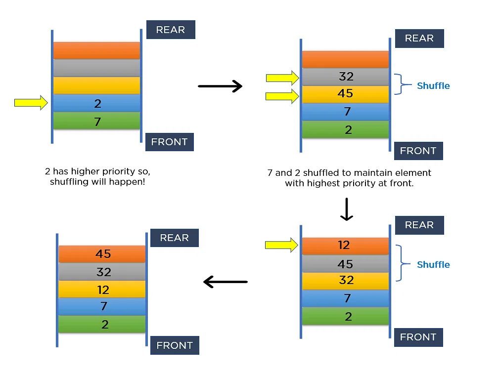
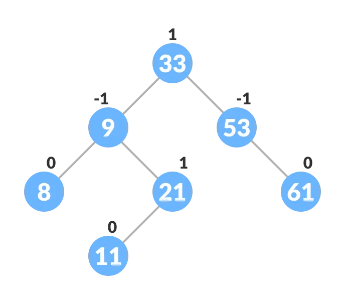

# DATA STRUCTURES

tutorial: https://www.geeksforgeeks.org/learn-data-structures-and-algorithms-dsa-tutorial/?ref=lbp
___
## ¿Qué es una Estructura de Datos?
Una estructura de datos se define como una forma particular de almacenar y organizar datos en nuestros dispositivos para utilizar los datos de manera eficiente y efectiva. La idea principal detrás del uso de estructuras de datos es minimizar las complejidades de tiempo y espacio. Una estructura de datos eficiente ocupa un espacio mínimo en la memoria y requiere un tiempo mínimo para ejecutar los datos.


### Clasificaciones de las Estructuras de Datos:
1. **ESTRUCTURA DE DATOS LINEAL:**
    - Una estructura de datos en la que los elementos de datos se organizan secuencial o linealmente, donde cada elemento se adjunta a sus elementos adyacentes anteriores y siguientes, se denomina estructura de datos lineal. Algunos ejemplos son la _Arrays (Arreglos), Matrices, Listas Enlazadas, Colas (Queues), Pilas (Stacks), Vectores Dinámicos, Colas de Prioridad, Listas Circulares_.
<br />
        - **ESTRUCTURA DE DATOS ESTÁTICA:** La estructura de datos estática tiene un tamaño de memoria fijo. Es más fácil acceder a los elementos de una estructura de datos estática. Un ejemplo de esta estructura de datos es una _Arrays (Arreglos), Matrices_.
<br />
        - **ESTRUCTURA DE DATOS DINÁMICA:** En la estructura de datos dinámicos, el tamaño no es fijo. Se puede actualizar aleatoriamente durante el tiempo de ejecución, lo que puede considerarse eficiente en cuanto a la complejidad de la memoria (espacio) del código. Ejemplos de esta estructura de datos son la _Listas Enlazadas, Colas (Queues), Pilas (Stacks), Vectores Dinámicos, Colas de Prioridad, Listas Circulares_.
<br />


2. **ESTRUCTURA DE DATOS NO LINEAL:**
    - Las estructuras de datos en las que los elementos de datos no se colocan de forma secuencial o lineal se denominan estructuras de datos no lineales. Algunos ejemplos son los _Árboles, Grafos, Montículos (Heaps), Tablas de Hash, Trie (Árbol de Prefijos)_.


___
## ARRAYS (https://www.geeksforgeeks.org/introduction-to-arrays-data-structure-and-algorithm-tutorials/)

La estructura de datos más básica pero importante es el **Array**. Es una estructura de datos lineal. Un Array es una colección de tipos de datos homogéneos en la que a los elementos se les asigna memoria contigua. Debido a la asignación contigua de memoria, se puede acceder a cualquier elemento de un array en tiempo constante. Cada elemento del array tiene un número de índice correspondiente.

### Notación de Array:
```js
[1, 2, 3, 4, 5] -> elementos
 0, 1, 2, 3, 4  -> índices
Longitud: 5

accediendo a elementos:
array[0] -> 1
array[1] -> 2
```


### Diferentes tipos de Arrays:
1. **Array unidimensional (1D):** Puede imaginar un array de 1D como una fila, donde los elementos se almacenan uno tras otro.
```c
[1,2,3,4,5]
```

2. **Array bidimensional (array 2D):** Una array que consta de filas y columnas
```c
[
    [1,2,3,4,5],
    [1,2,3,4,5]
]
```

3. **Array tridimensional (array 3D):** Contiene tres dimensiones, por lo que puede considerarse una array de arrays bidimensionales.
```c
[
    [[1, 2, 3, 4, 5], [1, 2, 3, 4, 5]], 
    [[1, 2, 3, 4, 5], [1, 2, 3, 4, 5]], 
    [[1, 2, 3, 4, 5], [1, 2, 3, 4, 5]]
]
```

### Tipos de operaciones de array:
- **Transversal:** Recorra los elementos de un array.
- **Inserción:** Inserción de un nuevo elemento en un array.
- **Eliminación:** Eliminación de elementos del array.
- **Búsqueda:** Busca un elemento en el array.
- **Ordenar:** Mantener el orden de los elementos en el array.

___
## LINKED LIST (https://www.geeksforgeeks.org/what-is-linked-list/?ref=roadmap)

La lista enlazada es una estructura de datos lineal, en la que los elementos no se almacenan en una ubicacion contigua, sino que se vinculan mediante punteros. La lista enlazada forma una serie de nodos, los cuales contienen los datos y un puntero al siguiente nodo.

### Elementos base de una lista enlazada:
- **Cabeza (Head):** Es una referencia al primer nodo de la lista. Sirve como punto de partida para acceder a los demás nodos.
- **Nodo (Node):** Un nodo en una lista enlazada es una estructura que contiene información (datos) y una referencia (puntero) a otro nodo, formando así una cadena de elementos conectados.
- **Cola (Tail):** En el caso de las listas doblemente enlazadas, a menudo también hay una referencia al último nodo de la lista, llamada cola.
- **Nodo final (NULL):** El último nodo de una lista enlazada simple tiene un puntero que apunta a null, indicando que es el final de la lista.
<br />

### Tipos de Listas Enlazadas:
1. Single-linked list
2. Double-linked list
3. Circular Linked List
4. Circular Doubly Linked List

<br />

### Single-linked list
En este tipo, cada nodo tiene un puntero que apunta al siguiente nodo en la lista. La lista termina en un nodo cuyo puntero es nulo, indicando que no hay más nodos. Recorrer una lista enlazada individualmente se realiza hacia adelante.

- Un nodo en una lista enlazada simple contiene los siguientes elementos:
    * **Datos:** Esta parte del nodo almacena el valor que se quiere guardar en la lista.
    * **Puntero a siguiente nodo:** Esta es la otra parte esencial de un nodo. El puntero es una referencia que "apunta" al siguiente nodo en la lista. En las listas enlazadas simples, cada nodo tiene un único puntero hacia el siguiente nodo. En las listas doblemente enlazadas, cada nodo tendría dos punteros: uno apuntando al siguiente nodo y otro al anterior. Este puntero es lo que permite que los nodos estén "enlazados" entre sí, formando una secuencia o cadena.


### Double-linked list
En una lista enlazada doble, cada nodo contiene una referencia del previo y siguiente nodo del mismo. Recorrer una lista enlazada doble se puede hacer en direcciones hacia atrás y adelante, aunque requiere memoria adicional para la referencia de nodo anterior.

- Un nodo en una lista enlazada doble contiene los siguientes elementos:
    * **Prev:** Puntero que apunta al nodo anterior en la lista
    * **Data:** Dato actual que almacena el nodo
    * **Next:** Puntero que apunta al siguiente nodo en la lista


### Circular linked list
En una lista circular simple, el último nodo está conectado de nuevo al primero, formando un círculo. Esto significa que no hay un "final" claro de la lista, y se puede seguir recorriendo la lista indefinidamente.

- En una Circular Linked List (Lista Enlazada Circular), un nodo contiene dos elementos principales:
    * **Data:** Dato actual que almacena el nodo
    * **Next:** En lugar de tener una referencia al siguiente nodo en una única dirección (como en una lista enlazada simple), en una Circular Linked List, el nodo también contiene una referencia al siguiente nodo, pero de manera circular. Esto significa que el último nodo de la lista enlaza de nuevo con el primer nodo, cerrando así el círculo (no tiene puntero a 'null').


### Circular Doubly Linked List
Una lista circular doblemente enlazada se define como una lista circular enlazada en la que cada nodo tiene dos enlaces que lo conectan con el nodo anterior y el siguiente


- En una Circular Doubly Linked List (Lista Doblemente Enlazada Circular), cada nodo contiene tres elementos principales:
    * **Data:** Dato actual que almacena el nodo
    * **Next:** Puntero que apunta al nodo siguiente en la lista
    * **Prev:** Puntero que apunta al nodo anterior en la lista


### Operaciones en Listas Enlazadas:
1. **Inserción:** Agregar un nuevo nodo a una lista enlazada implica ajustar los punteros de los nodos existentes para mantener la secuencia adecuada. La inserción se puede realizar al principio, al final o en cualquier posición dentro de la lista
    - Insert at begin
    - Insert at end
    - Insert at middle
    - Insert at pos
2. **Eliminación:** la eliminación de un nodo de una lista vinculada requiere ajustar los punteros de los nodos vecinos para salvar el espacio dejado por el nodo eliminado. La eliminación se puede realizar al principio, al final o en cualquier posición dentro de la lista.
    - Delete at begin
    - Delete at end
    - Delete at middle
    - Delete at pos
3. **Búsqueda:** la búsqueda de un valor específico en una lista vinculada implica recorrer la lista desde el nodo principal hasta que se encuentre el valor o se llegue al final de la lista.
    - Search if node exists


### Complexities (Single Linked List)

| Operation             | Complexity |
|-----------------------|------------|
| Insert at the head    | O(1)       |
| Insert at the end     | O(n)       |
| Insert at the middle  | O(n)       |
| Delete at the head    | O(1)       |
| Delete at the end     | O(n)       |
| Delete at the middle  | O(n)       |
| Search the list       | O(n)       |


### Complexities (Double Linked List)

| Operation             | Complexity |
|-----------------------|------------|
| Insert at the head    | O(1)       |
| Insert at the tail    | O(1)       |
| Insert at the middle  | O(n)       |
| Delete at the head    | O(1)       |
| Delete at the tail    | O(1)       |
| Delete at the middle  | O(n)       |
| Search the list       | O(n)       |


___
## STACK (https://www.geeksforgeeks.org/stack-data-structure/)
Una pila (stack en inglés) es una estructura de datos que sigue el principio de "último en entrar, primero en salir" (LIFO, por sus siglas en inglés). Esto significa que el último elemento agregado a la pila es el primero en ser eliminado.

### Las operaciones básicas que se pueden realizar en una pila son las siguientes:
- **push():** Inserts an element into the stack. It adds a new element to the top of the stack. If the stack is implemented using a fixed-size array, it checks if there is space available before adding the element. If the stack is implemented using a linked list, it allocates memory for the new element and adjusts pointers accordingly.

- **pop():** Removes and returns the top element from the stack. It also updates the stack's structure to reflect the removal. If the stack is empty, attempting to pop an element may result in an error or an undefined behavior, so it's often a good practice to check if the stack is empty before performing a pop operation.

- **top():** Returns the top element of the stack without removing it. It allows you to peek at the element currently at the top of the stack without modifying the stack's structure. If the stack is empty, it may return a special value (such as null or undefined) or throw an exception, depending on the implementation.

- **isEmpty():** Returns true if the stack is empty; otherwise, it returns false. This operation is useful to check whether there are any elements in the stack before attempting to pop or top an element.

- **isFull():** Checks to see if the stack is full, especially in implementations using fixed-size arrays. If the stack has a maximum capacity, this operation helps determine whether there is space to push more elements.

- **size():** Returns the number of elements currently in the stack. It provides information about the size of the stack, allowing for convenient checks and iterations.

- **initialize():** Initializes the stack. This operation is used to set up the initial state of the stack, including allocating memory or initializing any internal data structures. It is often called when creating a new stack.

- **display():** Prints all the elements inside the stack. It traverses the stack, starting from the top, and prints each element. This operation is useful for debugging and understanding the current state of the stack. Depending on the implementation, it may print the elements in a specific order (e.g., from top to bottom).


### Tipos de Stacks:
- **Fixed Size Stack:** Como su nombre indica, una pila de tamaño fijo tiene un tamaño fijo y no puede crecer ni reducirse dinámicamente. Si la pila está llena y se intenta agregarle un elemento, se produce un error de desbordamiento. Si la pila está vacía y se intenta eliminar un elemento de ella, se produce un error de desbordamiento inferior.
- **Dynamic Size Stack:** Una pila de tamaño dinámico puede crecer o reducirse dinámicamente. Cuando la pila está llena, aumenta automáticamente su tamaño para acomodar el nuevo elemento, y cuando la pila está vacía, disminuye su tamaño. Este tipo de pila se implementa mediante una lista enlazada, ya que permite cambiar fácilmente el tamaño de la pila.


### Diferencias con un Array:
- Un array es una estructura de datos estática con un tamaño fijo, mientras que un stack puede crecer o decrecer dinámicamente.
- Las operaciones de añadir (push) y eliminar (pop) en un stack se realizan solo en el tope, mientras que en un array, se pueden realizar en cualquier posición.
- Un stack sigue el principio LIFO, mientras que un array no tiene una relación directa con el orden de inserción/eliminación.


### Time and Space Complexities from different operations of a Stack


| OPERATION | BEST TIME COMPLEXITY | WORST TIME COMPLEXITY | AVERAGE TIME COMPLEXITY | SPACE COMPLEXITY |
|-----------|----------------------|-----------------------|--------------------------|------------------|
| Push      | O(1)                 | O(N)                  | O(1)                     | O(1)             |
| Pop       | O(1)                 | O(1)                  | O(1)                     | O(1)             |
| Peek      | O(1)                 | O(1)                  | O(1)                     | O(1)             |


___
## QUEUE (https://www.geeksforgeeks.org/queue-data-structure/)

Una cola (Queue) es una estructura de datos que sigue el principio FIFO (First-In-First-Out), lo que significa que el primer elemento que se añade es el primero en ser eliminado. En una cola, los elementos se añaden al final _(enqueue)_ y se eliminan desde el frente _(dequeue)_. Los Queues son útiles en situaciones donde los elementos deben procesarse en el orden en que llegan.


### Componentes de una Queue:
- **Elementos (Items o Datos):** Estos son los elementos individuales que se almacenan en la cola. Cada elemento puede representar un dato o una tarea específica que se debe procesar.

- **Frente (Front):** Es el extremo de la cola desde el cual se elimina el primer elemento. Cuando se realiza una operación de eliminación (dequeue), es el elemento en el frente de la cola el que se retira.

- **Final (Rear o Back):** Es el extremo de la cola al cual se añaden nuevos elementos. Cuando se realiza una operación de inserción (enqueue), es en el final de la cola donde se agrega el nuevo elemento.


### Caracteristicas de una Queue:
- Queue can handle multiple data.
- We can access both ends.
- They are fast and flexible. 


|                                     Basics operations from a Queue                                                      |
|-------------------------------------------------------------------------------------------------------------------------|
| Enqueue (Encolar)    | Agregar un elemento al final (o parte trasera) de la cola.                                       |
| Dequeue (Desencolar) | Eliminar el elemento del frente (o parte delantera) de la cola.                                  |
| Front (Frente)       | Obtener el elemento del frente de la cola sin eliminarlo.                                        |
| Rear (Parte trasera) | Obtener el elemento de la parte trasera de la cola sin eliminarlo.                               |
| IsEmpty (Está vacía) | Verificar si la cola está vacía.                                                                 |
| IsFull (Está llena)  | Verificar si la cola está llena (aunque este término no se aplica a implementaciones dinámicas). |


### Queue Types:
- #### Input Restricted Queue
This is a simple queue. In this type of queue, the input can be taken from only one end but deletion can be done from any of the ends.

- **Input Restricted Queue Operations**:
- _Mainly the following three basic operations are performed on input restricted queue:_
    - **insertRear():** Adds an item at the rear of the queue. 
    - **deleteFront():** Deletes an item from the front of the queue. 
    - **deleteRear():** Deletes an item from rear of the queue.

- _In addition to above operations, following operations are also supported_
    - **getFront():** Gets the front item from the queue. 
    - **getRear():** Gets the last item from the queue. 
    - **isEmpty():** Checks whether queue is empty or not. 
    - **isFull():** Checks whether queue is full or not. 


- ### Output Restricted Queue
This is also a simple queue. In this type of queue, the input can be taken from both ends but deletion can be done from only one end.

- **Output Restricted Queue Operations**:
- _Mainly the following three basic operations are performed on output restricted queue:_
    - **insertRear():** Adds an item at the rear of the queue. 
    - **insertFront():** Adds an item at the front of the queue. 
    - **deleteFront():** Deletes an item from the front of the queue. 

- _In addition to the above operations, the following operations are also supported_
    - **getFront():** Gets the front item from the m queue. 
    - **getRear():** Gets the last item from the m queue. 
    - **isEmpty():** Checks whether the r queue is empty or not. 
    - **isFull():** Checks whether the queue is full or not. 


- ### Circular Queue
This is a special type of queue where the last position is connected back to the first position. Here also the operations are performed in FIFO order.

- **Circular Queue Operations**:
- **Front:** Get the front item from the queue.
- **Rear:** Get the last item from the queue.
- **enQueue(value):** This function is used to insert an element into the circular queue. In a circular queue, the new element is always inserted at the rear position. 
    - Check whether the queue is full – [i.e., the rear end is in just before the front end in a circular manner].
    - If it is full then display Queue is full. 
        - If the queue is not full then, insert an element at the end of the queue.
- **deQueue():** This function is used to delete an element from the circular queue. In a circular queue, the element is always deleted from the front position. 
    - Check whether the queue is Empty.
    - If it is empty then display Queue is empty.
        - If the queue is not empty, then get the last element and remove it from the queue.


- ### Double-Ended Queue (Dequeue)
In a double-ended queue the insertion and deletion operations, both can be performed from both ends. Podría verse como un mecanismo que permite aunar en una única estructura las funcionalidades de las pilas (estructuras LIFO) y las colas (estructuras FIFO), en otras palabras, estas estructuras (pilas y colas) podrían implementarse fácilmente con una deque.


| Operation       | Description                                     | Time Complexity |
| --------------  | ------------------------------------------------| --------------- |
| push_front()    | Inserts the element at the beginning.           | O(1)            |
| push_back()     | Adds element at the end.                        | O(1)            |
| pop_front()     | Removes the first element from the deque.       | O(1)            |
| pop_back()      | Removes the last element from the deque.        | O(1)            |
| front()         | Gets the front element from the deque.          | O(1)            |
| back()          | Gets the last element from the deque.           | O(1)            |
| empty()         | Checks whether the deque is empty or not.       | O(1)            |
| size()          | Determines the number of elements in the deque. | O(1)            |


- ### Priority Queue
A priority queue is a special queue where the elements are accessed based on the priority assigned to them.

- **Properties of Priority Queue**
So, a priority Queue is an extension of the queue with the following properties:
- Every item has a priority associated with it.
- An element with high priority is dequeued before an element with low priority.
- If two elements have the same priority, they are served according to their order in the queue.

<br />

- **How is Priority assigned to the elements in a Priority Queue?**
In a priority queue, generally, the value of an element is considered for assigning the priority.
For example, _the element with the highest value is assigned the highest priority_ and _the element with the lowest value is assigned the lowest priority_. The reverse case can also be used i.e., the element with the lowest value can be assigned the highest priority. Also, the priority can be assigned according to our needs. 





- **Operations of a Priority Queue:**
_A typical priority queue supports the following operations:_

- 1. **Insertion in a Priority Queue**
When a new element is inserted in a priority queue, it moves to the empty slot from top to bottom and left to right. However, if the element is not in the correct place then it will be compared with the parent node. If the element is not in the correct order, the elements are swapped. The swapping process continues until all the elements are placed in the correct position.
<br />
- 2. **Deletion in a Priority Queue**
In a Priority Queue, deletion typically refers to removing an element from the queue based on its priority. The process of deletion in a Priority Queue is usually associated with extracting the element with the highest (or lowest) priority.

        - There are two common operations related to deletion in a Priority Queue:
        - **Extract-Max (or Extract-Min):** This operation involves removing and returning the element with the highest priority (for Max Priority Queue) or the lowest priority (for Min Priority Queue).

        - **Delete:** Deleting a specific element from the Priority Queue. This operation might require searching for the element based on its value, and once found, removing it while maintaining the priority order of the remaining elements.


- 3. **Peek in a Priority Queue**
This operation helps to return the maximum element from Max Heap or the minimum element from Min Heap without deleting the node from the priority queue.

<br />

- ### Types of Priority Queues
1. **Ascending order Priority Queues:**
As the name suggests, in ascending order priority queue, _the element with a lower priority value is given a higher priority in the priority list_. For example, if we have the following elements in a priority queue arranged in ascending order like 4,6,8,9,10. Here, 4 is the smallest number, therefore, it will get the highest priority in a priority queue and so when we dequeue from this type of priority queue, 4 will remove from the queue and dequeue returns 4.

1. **Descending order Priority Queue:**
The root node is the maximum element in a max heap, as you may know. It will also remove the element with the highest priority first. As a result, the root node is removed from the queue. This deletion leaves an empty space, which will be filled with fresh insertions in the future. The heap invariant is then maintained by comparing the newly inserted element to all other entries in the queue.


#### Difference between Priority Queue and Normal Queue?
There is no priority attached to elements in a queue, the rule of first-in-first-out(FIFO) is implemented whereas, in a priority queue, the elements have a priority. The elements with higher priority are served first.


#### Queue use cases
One place where Queues are often used is in breadth-first search (BFS) or in implementing a cache.


___
## Tree (https://www.geeksforgeeks.org/introduction-to-tree-data-structure-and-algorithm-tutorials/)

- Un árbol (Tree) es una estructura de datos jerárquica que consiste en nodos conectados por aristas. Cada nodo tiene un padre (excepto el nodo superior llamado raíz) y cero o más hijos. Cada nodo se denomina "node" y las aristas representan las relaciones jerárquicas entre los nodos.

### Componentes básicos de un Árbol:
- **Raíz (Root):** El nodo superior del árbol, desde el cual se originan todos los demás nodos.
- **Nodo (Node):** Cada elemento individual en el árbol.
- **Hoja (Leaf):** Nodos sin hijos en el extremo del árbol.
- **Padre e Hijo:** Relación que describe la conexión entre dos nodos, donde uno es el padre y el otro es el hijo.
- **Key (Clave):** La clave es la información que se almacena en el nodo y se utiliza para ordenar y buscar en el árbol.
- **Edge (Arista):** Es la conexión entre dos nodos. Cada nodo (excepto la raíz) tiene exactamente una arista que lo conecta a su nodo padre.
- **Sibling (Hermano):** Son nodos que comparten el mismo padre. Los nodos hermanos comparten el mismo nivel en la jerarquía del árbol.
- **Subtree (Subárbol):** Un subárbol es un conjunto de nodos y aristas dentro de un árbol que se pueden considerar como un árbol por sí mismo.


<br />

### Tipos de árboles

<br />

1. **Árbol binario (Binary Tree):** Cada nodo tiene al menos dos hijos.


- #### Tipos de arboles binarios:

<br />

2. **Árbol de Búsqueda Binaria (Binary Search Tree):** Cada nodo tiene al menos dos hijos.
    - Las propiedades que separan un _árbol de búsqueda_ de un _árbol binario normal_ son:
        - Todos los nodos del subárbol izquierdo son menores que el nodo raíz
        - Todos los nodos del subárbol derecho son más que el nodo raíz
        - Ambos subárboles de cada nodo también son BST, es decir, tienen las dos propiedades anteriores.
        [Más info sobre BST](https://www.programiz.com/dsa/binary-search-tree)
- Ejemplo de un Binary Search Tree:


3. **Árbol AVL (AVL Tree):** El árbol AVL es un árbol de búsqueda binaria autoequilibrado en el que cada nodo mantiene información adicional llamada _"factor de equilibrio"_, cuyo valor es -1, 0 o +1. El factor de equilibrio de un nodo en un árbol AVL es la diferencia entre la altura del subárbol izquierdo y la del subárbol derecho de ese nodo.
    - **Factor de equilibrio** = (altura del subárbol izquierdo - altura del subárbol derecho) o (altura del subárbol derecho - altura del subárbol izquierdo)

        La propiedad de autoequilibrio de un árbol avl se mantiene mediante el factor de equilibrio. El valor del factor de equilibrio siempre debe ser -1, 0 o +1.

    [Más info sobre AVL Tree](https://www.programiz.com/dsa/avl-tree)

    Un ejemplo de un árbol avl equilibrado es:



4.  **Árbol B (B-tree):** El árbol B es un tipo especial de árbol de búsqueda autoequilibrado en el que cada nodo puede contener más de una clave y puede tener más de dos elementos secundarios. Es una forma generalizada del árbol de búsqueda binaria. También se conoce como árbol m-way de altura equilibrada.


<br />

### Basic Operation Of Tree Data Structure:
- **Create:** create a tree in the data structure.
- **Insert:** Inserts data in a tree.
- **Delete:** Delete a specific node from the tree. It requires to reorganize the tree
- **Search:** Searches specific data in a tree to check whether it is present or not.
- **Traversal:** (explained below)

<br />

### **A Tree Data Structure can be traversed in following ways:**
- **Depth First Search or DFS:** Traverses a tree by exploring as far as possible along each branch before backtracking.
    - **Inorder Traversal:** Visits the left subtree, then the root, and finally the right subtree.

    - **Preorder Traversal:** Visits the root, then the left subtree, and finally the right subtree.

    - **Postorder Traversal:** Visits the left subtree, then the right subtree, and finally the root.

<br />

- **Level Order Traversal or Breadth First Search or BFS:** Visits nodes level by level, exploring all nodes at the current level before moving on to the next level.
    - **Boundary Traversal:** Covers the boundary nodes of a tree in an anticlockwise direction, including the leftmost nodes, leaves, and the rightmost nodes.

    - **Diagonal Traversal:** Follows the diagonal path of the tree, starting from the top-left to the bottom-right, visiting nodes of the same slope.


___


___


___


___


___
